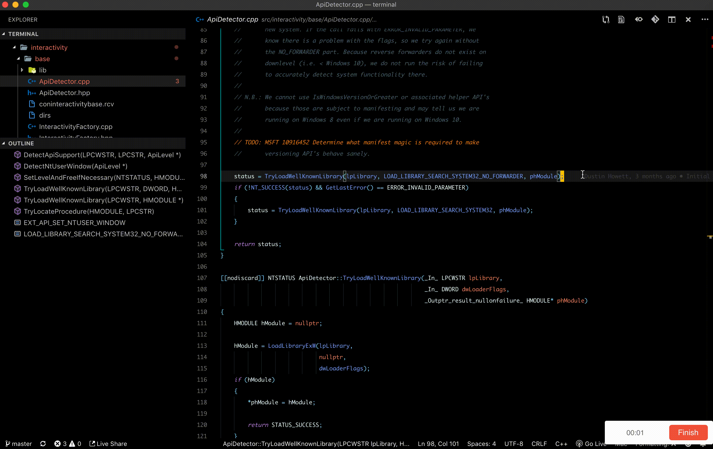

# Share Code Anytime

## 🤷‍️ Why I Need It

- Do you want to share code with other people, however, you can only take screenshots or copy code to an app that dosen't support monospaced fonts?
- Do you want to find the corresponding code in the remote repository, but you have to search the branch and file in the codebase?
- Do you always find the remote repository of the dependencies from the `package.json` file in the `node_modules`

## 🎉 Features

- [x] Open the corresponding code in remote repository(support GitHub, GitLab)
  - [x] Support GitHub, GitLab 
  - [ ] Support the file in the `node_modules`
- [ ] Share code in the Pastebin  

## Usage

1. Open a file or select a code block
2. `Shift + Cmd + P`, choose 'Share Code: Open Remote Repository'
3. Remote repository will open in your browser

## LISCENSE
MIT

**Enjoy!**
